# lab5_javascript.

Langkah-langkah Praktikum
Persiapan membuat dokumen HTML dengan nama file lab5_javascript.html seperti berikut.

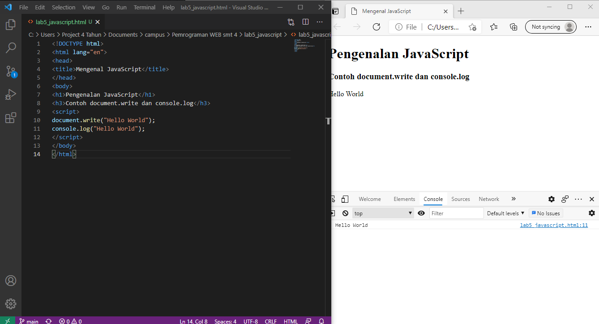

Java Script Dasar
Pemakaian Alert sebagai property window

Pemakaian method dalam objek

Pemakaian Prompt

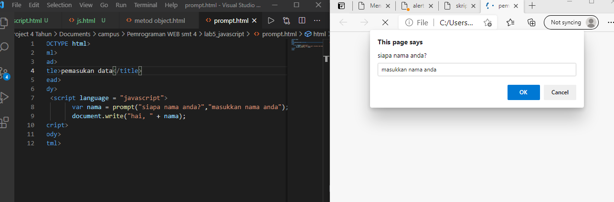
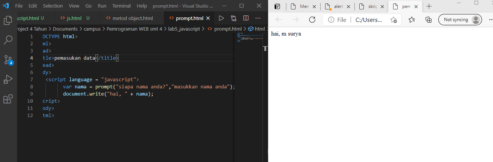

Pembuatan fungsi dan cara pemanggilannya

Dasar Pemrograman Di Javascript
Operasi dasar aritmatika

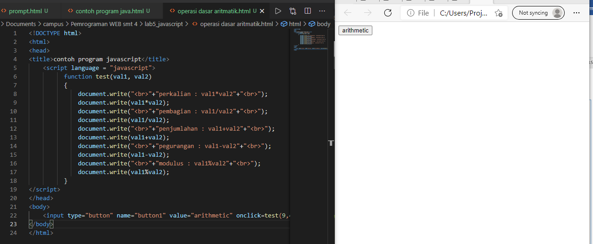
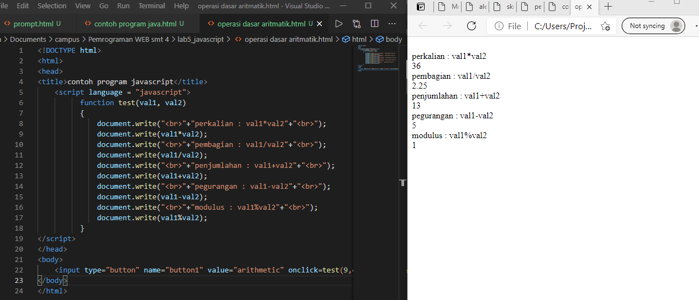

Seleksi kondisi (if..else)

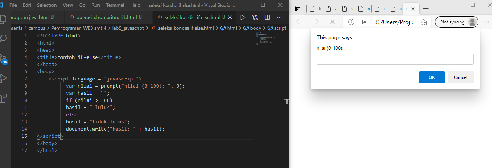
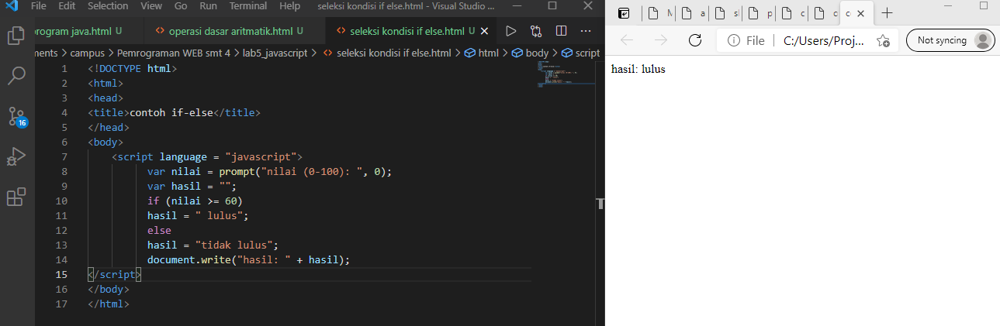

Penggunaan operator switch untuk seleksi kondisi

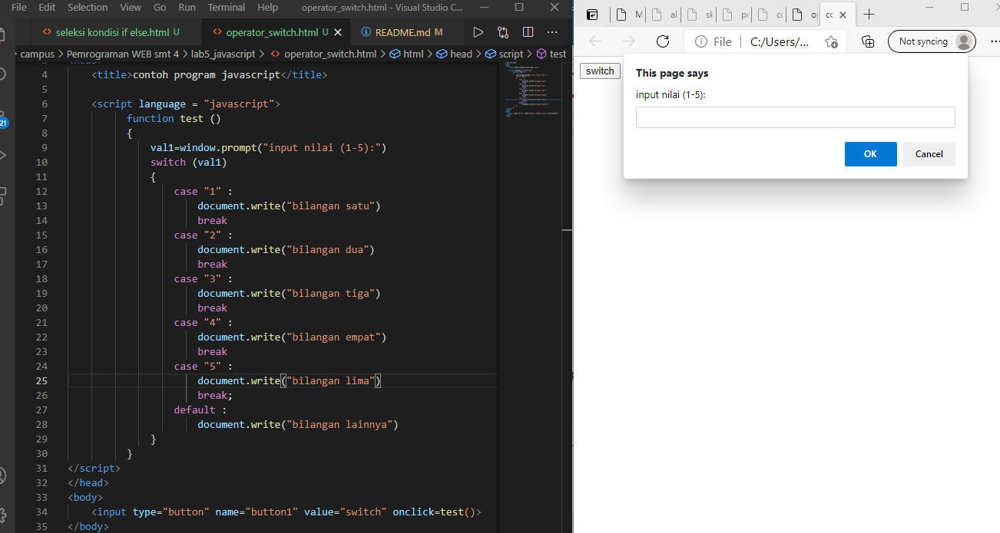
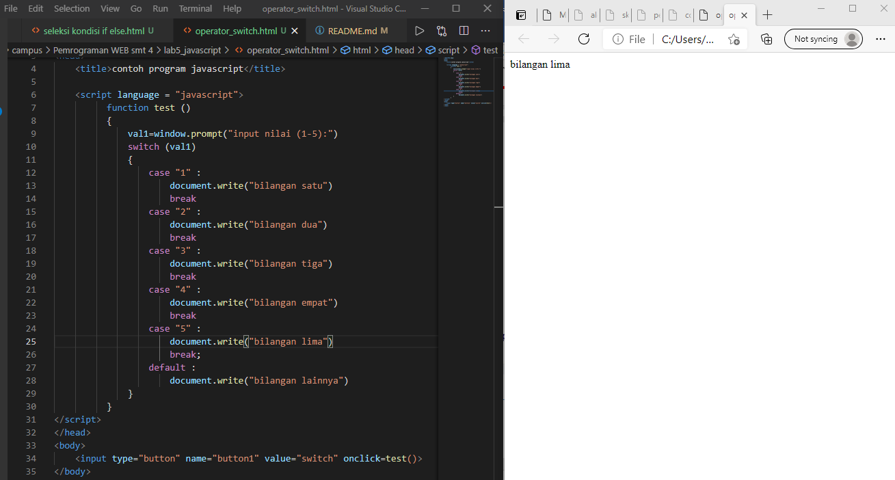

Pembuatan Form
Form Input

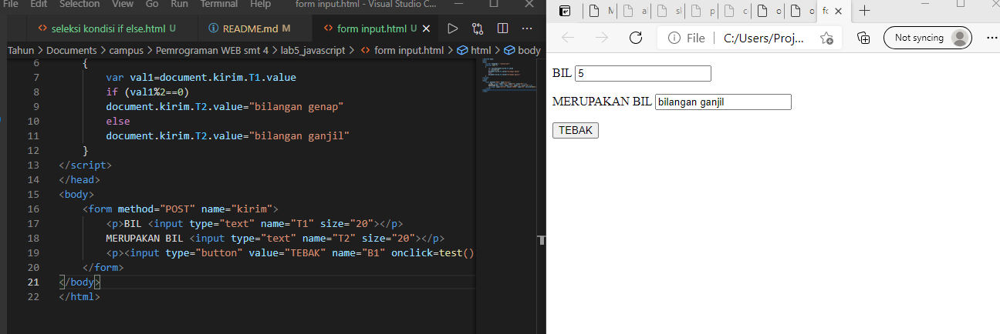

Form Button

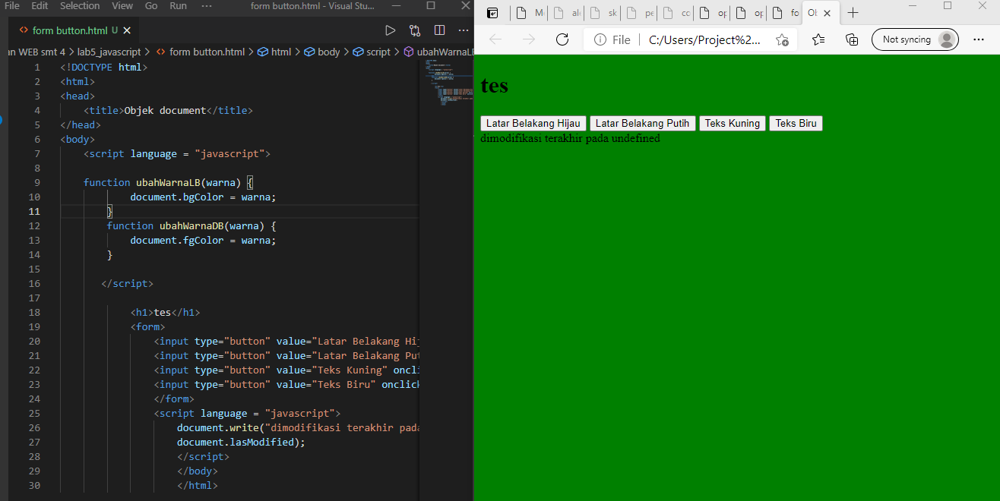

HTML DOM
Pilihan menggunakan checkBox dengan perhitungan otomatis

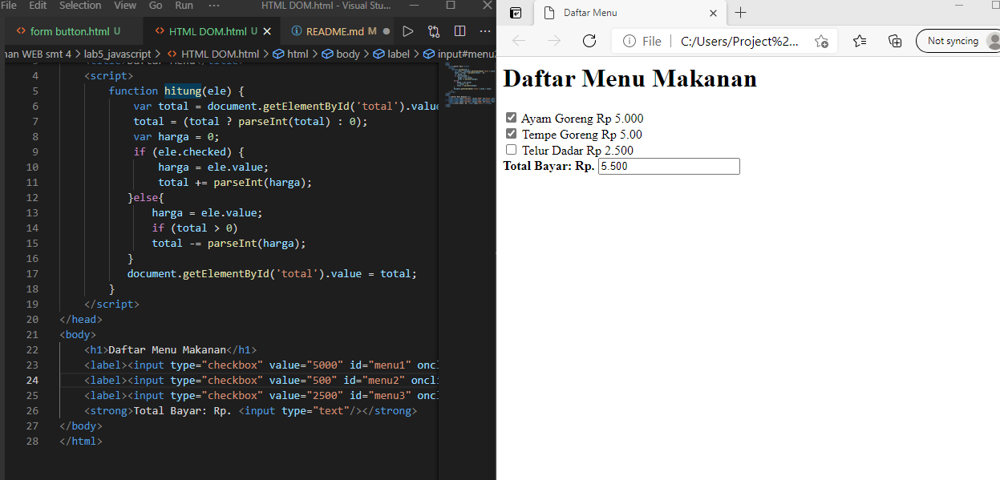

Buat script untuk melakukan validasi pada isian form.

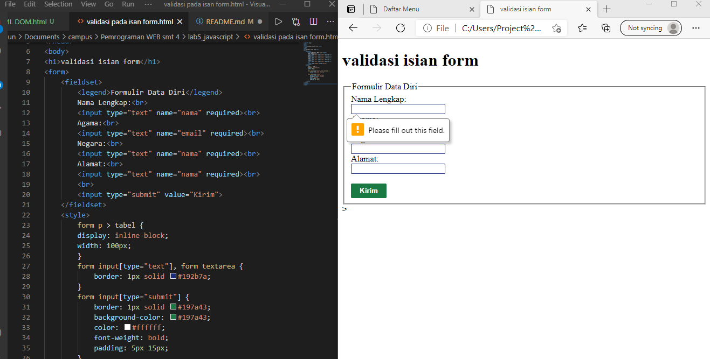
