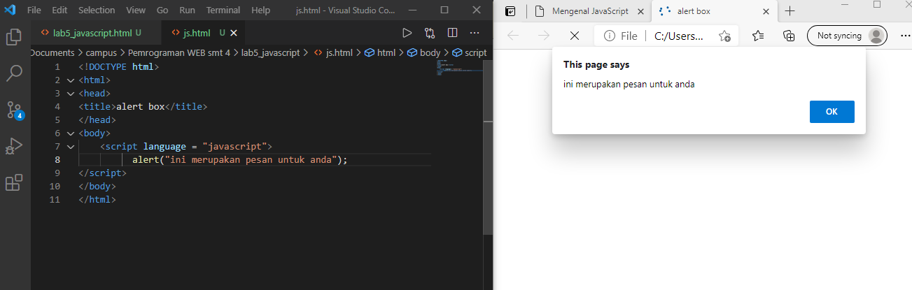
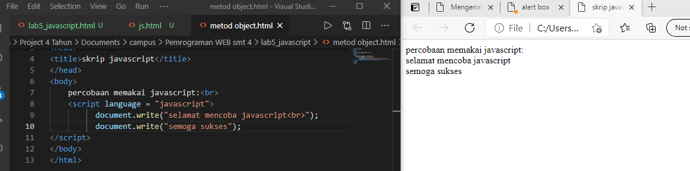

# lab5_javascript.

Langkah-langkah Praktikum
Persiapan membuat dokumen HTML dengan nama file lab5_javascript.html seperti berikut.

Java Script Dasar
Pemakaian Alert sebagai property window

Pemakaian method dalam objek

Pemakaian Prompt

Pembuatan fungsi dan cara pemanggilannya

Dasar Pemrograman Di Javascript
Operasi dasar aritmatika

Seleksi kondisi (if..else)

Penggunaan operator switch untuk seleksi kondisi

Pembuatan Form
Form Input

Form Button

HTML DOM
Pilihan menggunakan checkBox dengan perhitungan otomatis

Buat script untuk melakukan validasi pada isian form.

